## Maylan Markers

[ENGLISH README](README.EN.md)

Идея проста: вы ставите табличку в игре, и она появляется на вашей карте BlueMap.

Этот плагин является форком старого, более не поддерживаемого решения — [BlueMapSignMarkers](https://modrinth.com/plugin/bluemapsignmarkers) 
и более нового [Easy BlueMap Sign Markers](https://github.com/deimiczny/easy-bmapmarkers). 
В текущую версию внесены упрощения и небольшие улучшения для удобства использования по сравнению с оригинальным кодом.
Цель состояла в том, чтобы сделать плагин максимально понятным для игроков и требующим минимум шагов для настройки.

Работает только на Paper 26.1.2+

## Установка

Вам необходимо иметь установленный **BlueMap** на вашем сервере, так как плагин напрямую зависит от него.
Если **BlueMap** уже установлен, просто поместите jar-файл в папку `plugins` вашего сервера... и готово\!

## Как использовать

Установите любую табличку в игре. Заполните её следующим образом:

- **1-я строка**: `[название_иконки]` (доступные теги иконок см. в разделе _Названия маркеров_)
- **2-я строка:** текст
- **3-я строка:** текст
- **4-я строка:** текст

**Примечание:** после создания маркера текст на первой строке изменится на `> marker <`. Это сделано для того, чтобы игроки понимали, что данная табличка является маркером, и не удалили её случайно.

Первая строка **ОБЯЗАТЕЛЬНО** должна быть заполнена. Если в первой строке нет корректного названия иконки, но используются скобки `[` и `]`, будет назначено значение по умолчанию — `[map]` — и маркер всё равно будет создан.
Из последующих трёх текстовых строк хотя бы одна должна быть заполнена. Если все они пусты, маркер не создастся. Мы исходим из того, что маркеру **нужно** описание.

## Пример

В примере ниже мы создадим маркер с иконкой звезды (`star`).

Сначала вы подписываете табличку:

После завершения редактирования первая строка изменится на `> marker <`. Это означает, что маркер успешно установлен.

Через некоторое время вы увидите маркер на вашей карте BlueMap:

А если кликнуть по нему, появится всплывающее окно с описанием вашей таблички:

## Названия маркеров

Ниже приведены доступные названия для маркеров и соответствующие им иконки. Просто впишите любое значение в квадратных скобках (например, `[bank]`), чтобы установить маркер на **BlueMap**.
Регистр букв не важен (можно писать как маленькими, так и заглавными), плагин всё поймёт.

| Название     | Иконка | Примечание | Название | Иконка | Примечание   |
|--------------|:-------------------------------------------------------------------:|----------------|-------------|:---------------------------------------------------------------------------------------------------------------------------------:|--------------|
| anchor       |              |                | key         |                                         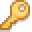                                         |              |
| bank         |         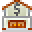         |                | king        |                                        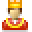                                        |              |
| basket       |       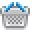       |                | left        |                                                                                |              |
| bed          |          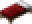          |                | lightbulb   |                                                                      |              |
| beer         |                  |                | lighthouse  |                                                                    |              |
| bighouse     |     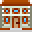     |                | lock        |                                                                                |              |
| blueflag     |          |                | **map**         |                                                                                  | По умолчанию |
| bomb         |                  |                | minecart    |                                    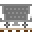                                    |              |
| bookshelf    |    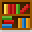    |                | offlineuser |                                 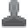                                 |              |
| bricks       |              |                | orangeflag  |                                                                    |              |
| bronzemedal  |    |                | pinkflag    |                                                                        |              |
| bronzestar   |   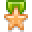   |                | pirateflag  |                                                                    |              |
| building     |          |                | pointdown   |                                                                      |              |
| cake         |         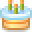         |                | pointleft   |                                                                      |              |
| camera       |              |                | pointright  |                                                                    |              |
| cart         |                  |                | pointup     |                                                                          |              |
| caution      |            |                | portal      |                                                                            |              |
| chest        |                |                | purpleflag  |                                                                    |              |
| church       |              |                | queen       |                                       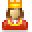                                       |              |
| coins        |                |                | redflag     |                                                                          |              |
| comment      |            |                | right       |                                                                              |              |
| compass      |      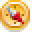      |                | ruby        |                                                                                |              |
| construction |  |                | scales      |                                                                            |              |
| cross        |        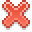        |                | shield      |                                                                            |              |
| cup          |                    |                | sign        |                                                                                |              |
| cutlery      |      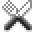      |                | silvermedal |                                                                  |              |
| diamond      |            |                | silverstar  |                                                                    |              |
| dog          |                    |                 | skull       |                                                                              |              |
| door         |                  |                | star        |                                                                                |              |
| down         |                  |                | sun         |                                                                                  |              |
| drink        |                |                | temple      |                                                                            |              |
| end  |  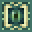  |                | theater     |                                                                          |              |
| exclamation  |    |                | tornado     |                                     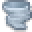                                     |              |
| factory      |            |                | tower       |                                       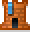                                       |              |
| fire         |                  |                | tree        |                                        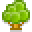                                        |              |
| flower       |              |                | truck       |                                                                              |              |
| gear         |         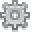         |                | up          |                                                                                    |              |
| goldmedal    |        |                | walk        |                                                                                |              |
| goldstar     |          |                 | warning     |                                                                          |              |
| greenflag    |        |                | world       |                                                                              |              |
| hammer       |       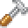       |                | wrench      |                                      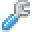                                      |              |
| heart        |                |                | yellowflag  |                                                                    |              |
| house        |        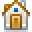        |                | x |                                  x                                  |              |

Используемые изображения являются апскейлом оригинальных ассетов Dynmap. Вы можете найти их здесь:

- [Dynmap на GitHub](https://github.com/webbukkit/dynmap)
- [Оригинальные ресурсы](https://github.com/webbukkit/dynmap/tree/v3.0/DynmapCore/src/main/resources/markers)

## Скачать

Вы можете скачать плагин на [GitHub](https://github.com/MayLAN-Craft/maylan-markers/releases)
